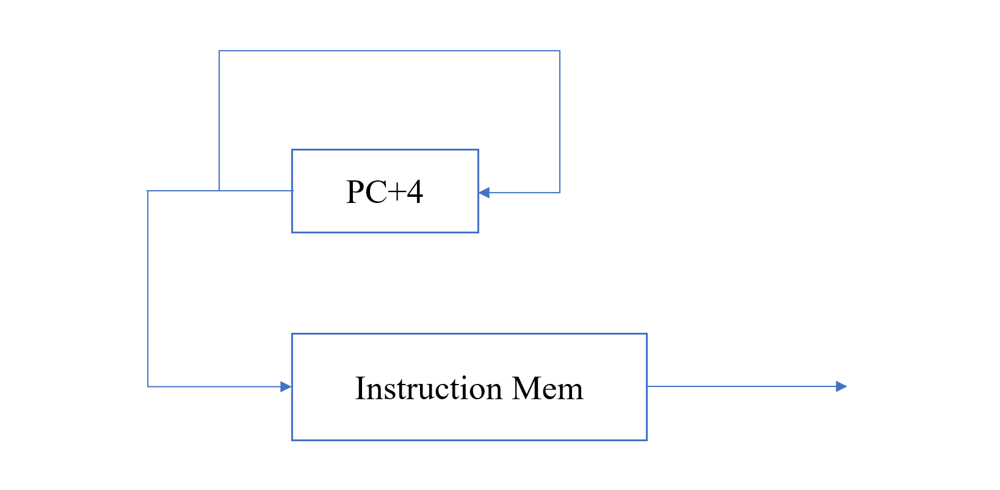

# Lab 2: Preliminary - Instrucion Memory

## Lab 简介

本学期的单周期 CPU 模拟实验使用 Scala 作为编程语言，并使用 Chisel3 作为框架。本实验的目标是制作一个 Instruction Memory，并连接 PC + 4 单元。Top 结构如下。



## 前期准备

同 Lab 1

## 实验步骤

### 指南

clone 仓库

```bash
git clone https://github.com/CA-2021Spring-Lab/Instr-Mem
# or git clone https://gitee.com/ca-2021-spring-lab/Instr-Mem
cd Instr-Mem
```

进入仓库，拉取镜像

校园网或校内 VPN 拉取镜像命令

```bash
docker pull 10.176.122.240/lab1/sbt:latest
docker tag 10.176.122.240/lab1/sbt:latest sbt
```

公网环境拉取镜像命令

```bash
docker pull hoshinotouko/sbt:latest
docker tag hoshinotouko/sbt:latest sbt
```

pull 完成后，运行 `docker-compose up -d` 启动实验环境，然后运行 `docker exec -it sbt bash` 进入实验容器。

实验结束后，执行 `exit` 退出容器，并执行 `docker-compose down` 关闭容器。

直接在仓库中的 `./workspace/` 文件夹下编辑代码，对应位置已经映射到容器中的 `/workspace` 文件夹。请参考 chisel3、scala 编程手册，按照要求编写。

### 程序执行和测试

在容器中运行 `sbt` 进入环境，执行 `test:runMain rv32i.Tester Top` 运行测试。初次运行 sbt 时，可能需要一段时间下载运行环境。

### 实验要求

代码已经封装好实验需要模块的 IO，请根据要求编写模块内的代码，并在 Top 模块中连线。

在 instr.txt 文件中输入对应指令的十六进制码，运行 Test，在每一个时钟周期用 `printf` 输出当前 Instr Mem 的输出值。已有的十六进制码可以使用 Lab 1-1 的生成结果替换（用于后续实验）。

## 评分标准

- 完成上述实验 (10/10)